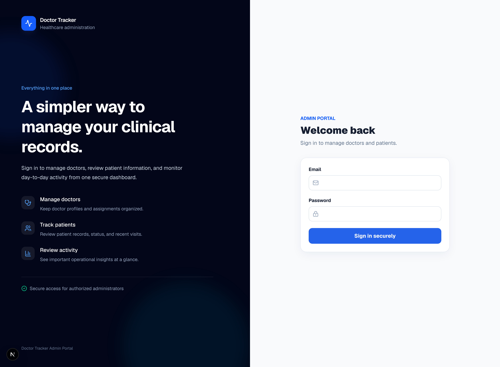
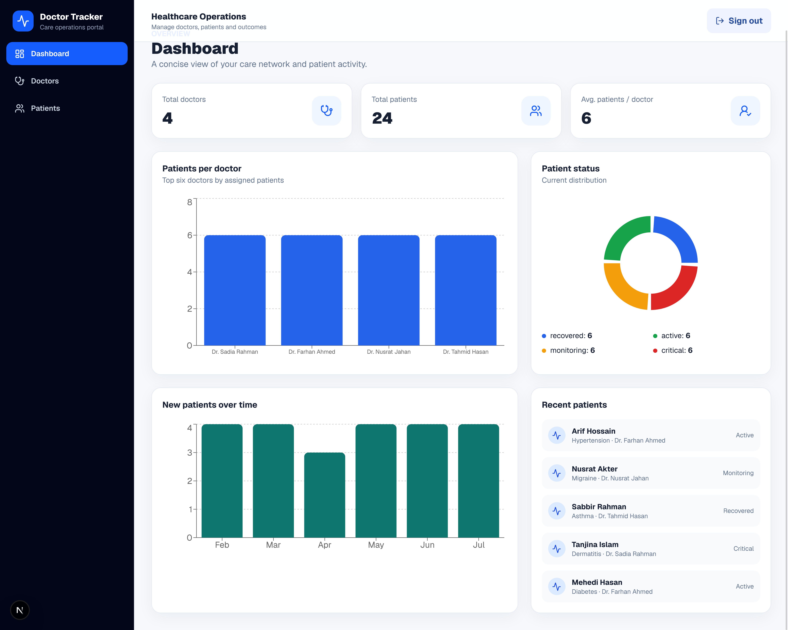
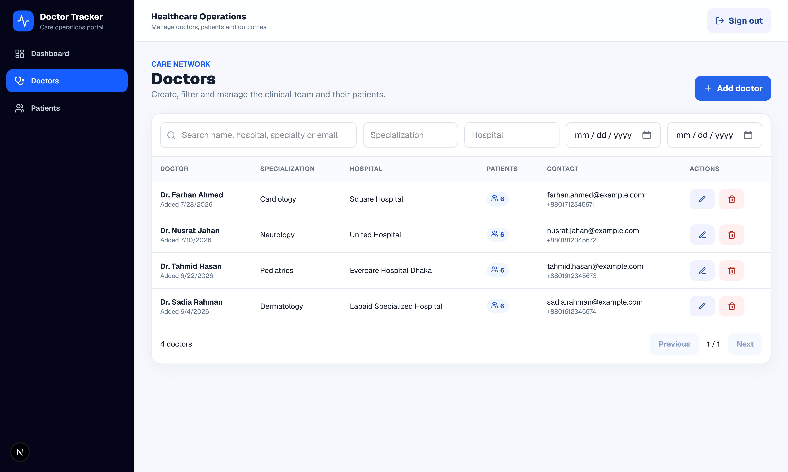
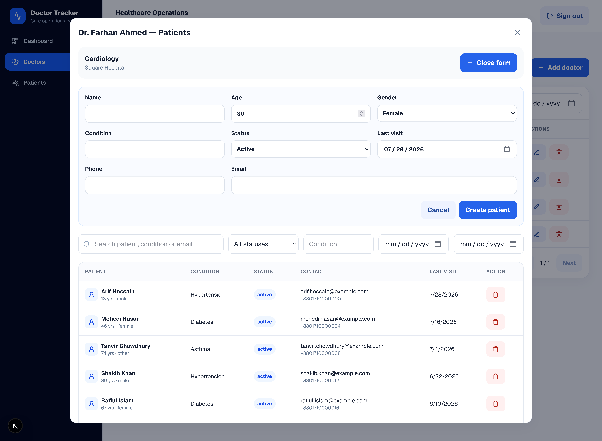
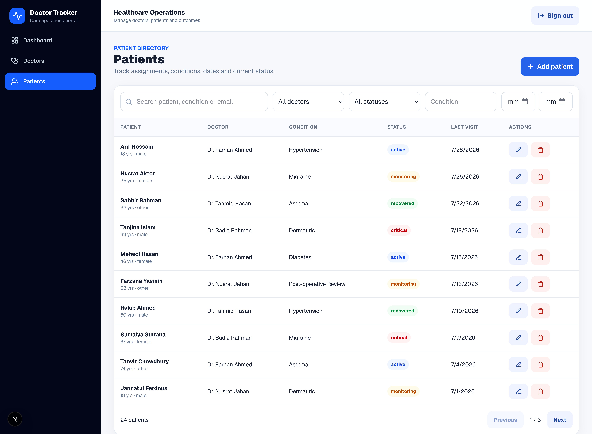

# Doctor Tracker

A modern healthcare administration portal for managing doctors, patients, and clinical operations.

Built with **Next.js**, **TypeScript**, **MongoDB**, and **Tailwind CSS**.

---

## Live Demo

**Application:** _(Will be added after deployment)_

Demo credentials are intentionally not included in this public repository. They will be shared privately with the recruiter for evaluation.

---

## Features

- Secure authentication using HTTP-only JWT cookies
- Dashboard with operational analytics and charts
- Doctor management (Create, Read, Update, Delete)
- Patient management (Create, Read, Update, Delete)
- Doctor-to-patient assignment workflow
- Server-side search, filtering, and pagination
- Protected API routes
- MongoDB aggregation and indexed queries
- Responsive user interface

---

## Tech Stack

- Next.js 16
- React 19
- TypeScript
- Tailwind CSS
- MongoDB Native Driver
- Zod
- bcryptjs
- jose (JWT)
- Recharts

---

## Screenshots

### Login



---

### Dashboard



---

### Doctors



---

### Doctor Patients

Manage patients assigned to a specific doctor directly from the Doctors page.



---

### Patients



---

## Running Locally

```bash
git clone <repository-url>

cd doctor-tracker

pnpm install

cp .env.example .env.local

pnpm seed

pnpm dev
```

The application will be available at:

```
http://localhost:3000
```

---

## Environment Variables

Create a `.env.local` file using `.env.example`.

Required variables:

```env
MONGODB_URI=
MONGODB_DB_NAME=
JWT_SECRET=
SEED_ADMIN_EMAIL=
SEED_ADMIN_PASSWORD=
```

---

## Project Structure

```text
app/
components/
features/
lib/
public/
scripts/
types/
```

---

## API Endpoints

```http
POST   /api/auth/login
POST   /api/auth/logout

GET    /api/dashboard

GET    /api/doctors
POST   /api/doctors
PATCH  /api/doctors/:id
DELETE /api/doctors/:id

GET    /api/patients
POST   /api/patients
PATCH  /api/patients/:id
DELETE /api/patients/:id
```

---

## Architecture Highlights

- RESTful API design
- Repository and Service pattern
- MongoDB aggregation pipelines
- Indexed server-side search and pagination
- Cookie-based authentication
- Feature-based project structure
- Input validation using Zod
- Responsive dashboard interface

---

## License

This project was created as part of a Full-Stack Development interview assessment.
